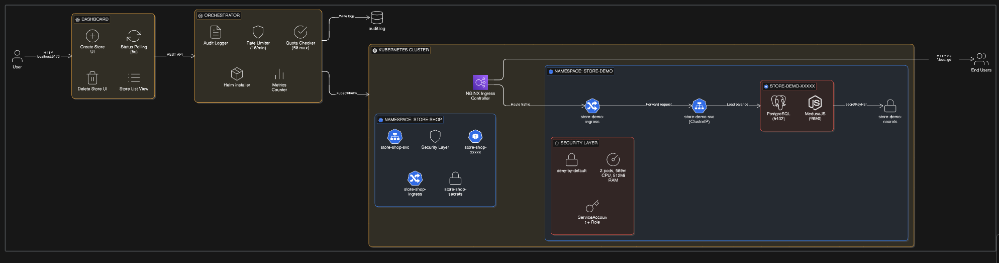

# Urumi SDE Assessment - Round 1

## Store Provisioning Platform

Multi-tenant Kubernetes-based e-commerce store provisioning with MedusaJS, featuring namespace isolation, RBAC, NetworkPolicies, and Helm-based deployments.

---

## 📹 Demo Video

[](https://www.loom.com/share/0b0a3b9cafbc46739c7d41b78d580bf5)

**[▶️ Watch Full Demo on Loom](https://www.loom.com/share/0b0a3b9cafbc46739c7d41b78d580bf5)**

---



## 🚀 Quick Start (Local Kind Cluster)

### Prerequisites

- Docker Desktop running
- `kind`, `kubectl`, `helm` installed
- Node.js v18+ for orchestrator and dashboard

### Setup Steps

1. **Create Kind Cluster**

   ```bash
   kind create cluster --name urumi-challenge --config kind-config.yaml
   ```

2. **Install Nginx Ingress Controller**

   ```bash
   kubectl apply -f https://raw.githubusercontent.com/kubernetes/ingress-nginx/main/deploy/static/provider/kind/deploy.yaml

   # Wait for ingress to be ready (important!)
   kubectl wait --namespace ingress-nginx \
     --for=condition=ready pod \
     --selector=app.kubernetes.io/component=controller \
     --timeout=120s
   ```

3. **Start Orchestrator** (Terminal 1)

   ```bash
   cd orchestrator
   npm install
   node index.js
   ```

4. **Start Dashboard** (Terminal 2)

   ```bash
   cd dashboard
   npm install
   npm run dev
   ```

5. **Configure Hosts File**
   - Windows: Edit `C:\Windows\System32\drivers\etc\hosts` as Administrator
   - Linux/Mac: Edit `/etc/hosts`
   - Add: `127.0.0.1 store-myshop.local.gd`

6. **Open Dashboard**: http://localhost:5173

---

## 🔄 Storage Strategy (Local vs Production)

This platform uses **conditional storage** via Helm values to optimize for different environments:

### Local Development (Kind)

- **Values File**: `values-local.yaml`
- **Storage Type**: `emptyDir` (ephemeral)
- **Rationale**:
  - Fast iteration without PVC provisioning delays
  - No PersistentVolume cleanup needed
  - Fresh database on each pod restart (useful for testing)
- **Trade-off**: Data lost on pod restart (acceptable for local testing)

**Configuration**:

```yaml
# values-local.yaml
storage:
  usePVC: false # Uses emptyDir
  class: standard
  size: 1Gi
```

### Production (VPS/k3s)

- **Values File**: `values-prod.yaml`
- **Storage Type**: `PersistentVolumeClaim`
- **Rationale**:
  - Database persists across pod restarts
  - Survives node failures and upgrades
  - Production-grade data durability
- **Storage Class**: `local-path` (k3s default provisioner)

**Configuration**:

```yaml
# values-prod.yaml
storage:
  usePVC: true # Creates PVC
  class: local-path
  size: 5Gi
```

### How It Works

The [deployment.yaml](charts/medusa-store/templates/deployment.yaml#L77-L85) template uses conditional logic:

```yaml
volumes:
  - name: storage
    {{- if .Values.storage.usePVC }}
    persistentVolumeClaim:
      claimName: {{ .Release.Name }}-data
    {{- else }}
    emptyDir: {}
    {{- end }}
```

When `storage.usePVC: true`, the [pvc.yaml](charts/medusa-store/templates/pvc.yaml) template creates a PersistentVolumeClaim.

---

## ✅ Definition of Done: Order Placement Test

The assessment requires demonstrating end-to-end order placement. Since the MedusaJS Docker image used is API-only (no storefront UI), we validate via API:

### Automated Test Script

```powershell
# Windows PowerShell
.\test-order.ps1
```

This script performs a complete order flow:

1. Health check
2. Fetch products
3. Create cart
4. Add item to cart
5. Add shipping address
6. Select shipping method
7. Complete order
8. Verify order created

**Expected Output**:

```
╔═══════════════════════════════════════════════════════════╗
║              ORDER PLACEMENT SUCCESSFUL! ✓               ║
╚═══════════════════════════════════════════════════════════╝

  Order ID: order_01HQXXXXXXXXX
  Customer: test@example.com
  Product: Medusa Sweatshirt
  Status: pending

  ✓ Definition of Done: ACHIEVED
  ✓ Store can process orders end-to-end
```

### Manual API Testing

You can also test endpoints manually:

```bash
# Health check
curl http://store-myshop.local.gd/health

# List products
curl http://store-myshop.local.gd/store/products

# List regions
curl http://store-myshop.local.gd/store/regions

# Admin API (requires authentication)
curl http://store-myshop.local.gd/admin/auth
```

---

## 🏗️ Architecture Overview

### Components

1. **React Dashboard** (Port 5173)
   - Create/view/delete stores
   - Real-time status polling
   - Responsive UI with Tailwind CSS

2. **Node.js Orchestrator** (Port 3001)
   - REST API for store CRUD operations
   - Helm chart deployment orchestration
   - Kubernetes API integration
   - Rate limiting (10 req/min per IP)
   - Store limit enforcement (max 50 stores)
   - Audit logging to `audit.log`

3. **Helm Chart** (`charts/medusa-store/`)
   - MedusaJS backend (jmflaherty/medusajs-backend:latest)
   - PostgreSQL 13 sidecar
   - Nginx Ingress routing
   - ResourceQuota + NetworkPolicy
   - RBAC (ServiceAccount + Role + RoleBinding)
   - Random JWT secrets per store

### Isolation Strategy

Each store gets:

- **Dedicated Namespace** (`store-<name>`)
- **NetworkPolicy** (deny-by-default, allow from ingress-nginx only)
- **ResourceQuota** (max 2 pods, 500m CPU, 512Mi RAM)
- **RBAC** (least-privilege ServiceAccount)
- **Unique Secrets** (random JWT tokens via Helm)

---

## 🛡️ Security & Abuse Prevention

### Implemented Guardrails

1. **Rate Limiting**: 10 API requests per minute per IP
   - Returns HTTP 429 when exceeded
   - Audit log entry created

2. **Store Count Limits**: Maximum 50 stores cluster-wide
   - Prevents resource exhaustion
   - Configurable in `orchestrator/index.js`

3. **Provisioning Timeouts**: Helm install times out after 5 minutes
   - Prevents hung deployments
   - Automatic cleanup on failure

4. **Audit Logging**: All actions logged to `audit.log`
   - Store creation/deletion
   - Rate limit violations
   - Failed operations
   - Timestamp + details

5. **NetworkPolicies**: Inter-store traffic blocked
   - Pods can only receive traffic from ingress-nginx
   - Namespace-level isolation

6. **RBAC**: Least-privilege access
   - Each store has dedicated ServiceAccount
   - Role limited to own namespace resources
   - No cluster-wide permissions

---

## 📊 Monitoring & Observability

### Metrics Endpoint

```bash
curl http://localhost:3001/api/metrics
```

**Response**:

```json
{
  "created": 5,
  "deleted": 2,
  "failures": 1
}
```

### Audit Log

View all platform actions:

```bash
tail -f orchestrator/audit.log
```

**Example Entries**:

```
[2026-02-14T01:00:00.000Z] STORE_CREATE_START: {"storeId":"store-myshop","name":"myshop"}
[2026-02-14T01:00:15.000Z] STORE_CREATE_SUCCESS: {"storeId":"store-myshop"}
[2026-02-14T01:05:30.000Z] RATE_LIMIT_EXCEEDED: {"ip":"127.0.0.1"}
[2026-02-14T01:10:00.000Z] STORE_DELETE_START: {"storeId":"store-myshop"}
```

### Kubernetes Resources

```bash
# View all stores
kubectl get ns -l kubernetes.io/metadata.name | grep ^store-

# Inspect specific store
kubectl get all,netpol,resourcequota,sa,role,rolebinding -n store-myshop

# Check pod status
kubectl get pods -n store-myshop

# View logs
kubectl logs -n store-myshop deployment/store-myshop -c medusa --tail=50
```

---

## 🔧 Troubleshooting

### Store Stays in "Provisioning"

**Check pod status**:

```bash
kubectl get pods -n store-<name>
```

**View logs**:

```bash
kubectl logs -n store-<name> -l app=medusa
```

**Common causes**:

- Image still pulling (wait 2-3 mins)
- Database initialization (PostgreSQL takes ~60s)
- MedusaJS seeding (can take 30-60s)

### "Cannot GET /" at store URL

**Expected behavior**: The jmflaherty/medusajs-backend image is API-only (no storefront UI).

**Test API instead**:

```bash
curl http://store-<name>.local.gd/health
# Should return: OK
```

### Delete Fails to Clean Up

**Manual cleanup**:

```bash
helm uninstall store-<name> -n store-<name>
kubectl delete namespace store-<name>
```

### Rate Limit Hit

**Wait 60 seconds** and try again, or increase `MAX_REQUESTS_PER_MINUTE` in `orchestrator/index.js`.

---

## 🚀 Production Deployment (VPS with k3s)

### VPS Setup

1. **Install k3s**:

   ```bash
   curl -sfL https://get.k3s.io | sh -
   ```

2. **Copy kubeconfig**:

   ```bash
   # On VPS
   sudo cat /etc/rancher/k3s/k3s.yaml > ~/.kube/config

   # Or copy to local machine and update server URL
   ```

3. **Deploy with Production Values**:

   ```bash
   helm install store-demo ./charts/medusa-store \
     --namespace store-demo \
     --create-namespace \
     -f values-prod.yaml
   ```

4. **Update Orchestrator**:
   Set environment variable to use prod values:
   ```bash
   export NODE_ENV=production
   # Orchestrator will use values-prod.yaml
   ```

### Configuration Differences

| Aspect             | Local (Kind)      | Production (k3s VPS)         |
| ------------------ | ----------------- | ---------------------------- |
| **Storage Class**  | `standard`        | `local-path`                 |
| **Ingress Domain** | `*.local.gd`      | `*.yourdomain.com`           |
| **TLS**            | None              | cert-manager + Let's Encrypt |
| **Secrets**        | K8s Secrets       | External Secrets Operator    |
| **DNS**            | hosts file        | Wildcard A record            |
| **Load Balancer**  | Kind port mapping | Cloud LB or MetalLB          |

### Helm Upgrade/Rollback

```bash
# Upgrade store to new image version
helm upgrade store-myshop ./charts/medusa-store \
  -n store-myshop \
  --set image=jmflaherty/medusajs-backend:v2.0 \
  --reuse-values

# Rollback if something breaks
helm rollback store-myshop -n store-myshop

# View release history
helm history store-myshop -n store-myshop
```

---

## 📈 Horizontal Scaling Strategy

### Scalable Components

1. **Orchestrator API**:

   ```yaml
   # orchestrator-deployment.yaml (future)
   apiVersion: apps/v1
   kind: Deployment
   metadata:
     name: orchestrator
   spec:
     replicas: 3 # Scale horizontally
     template:
       spec:
         containers:
           - name: orchestrator
             image: orchestrator:latest
   ```

   - Stateless design (Helm state in K8s)
   - Load balance with K8s Service
   - Share audit log via PVC or external logging

2. **Dashboard**:
   - Already stateless (React SPA served from CDN)
   - Scale via CDN distribution
   - No backend coupling

3. **MedusaJS Stores**:
   - Currently 1 replica per store
   - Can scale to multiple replicas:
     ```bash
     kubectl scale deployment/store-myshop -n store-myshop --replicas=3
     ```
   - Requires:
     - Shared Redis (add Redis deployment)
     - PostgreSQL connection pooling
     - Session affinity for admin panel

### Provisioning Concurrency

**Current**: Sequential Helm installs  
**Improvement**: Job queue with worker pool

- Use BullMQ or similar queue
- Worker pool processes N stores in parallel
- Prevents resource contention

### State Management

- **Helm Release State**: Stored in K8s Secrets (automatically shared)
- **Audit Log**: Move to centralized logging (Loki/Elasticsearch)
- **Metrics**: Export to Prometheus for aggregation

---

## 📁 Project Structure

```
urumi-challenge/
├── charts/medusa-store/          # Helm chart
│   ├── Chart.yaml
│   ├── values.yaml               # Default values
│   └── templates/
│       ├── deployment.yaml       # Multi-container pod spec
│       ├── service.yaml          # ClusterIP service
│       ├── ingress.yaml          # HTTP routing
│       ├── secret.yaml           # Random JWT tokens
│       ├── rbac.yaml             # SA + Role + RoleBinding
│       ├── guardrails.yaml       # ResourceQuota + NetworkPolicy
│       └── pvc.yaml              # Persistent storage (optional)
├── orchestrator/                 # Node.js backend
│   ├── index.js                  # REST API + Helm integration
│   ├── package.json
│   └── audit.log                 # Generated at runtime
├── dashboard/                    # React frontend
│   ├── src/App.jsx               # Main UI component
│   ├── package.json
│   └── vite.config.js
├── values-local.yaml             # Kind cluster config
├── values-prod.yaml              # VPS/k3s config
├── kind-config.yaml              # Kind cluster spec
├── test-order.ps1                # Order placement test
├── README.md                     # This file
├── SystemDesign.md               # Architecture deep dive
└── AUDIT.md                      # Project compliance audit
```

---

## 🎯 Assessment Checklist

- [x] **Multi-store provisioning** with dashboard
- [x] **Definition of Done**: Order can be placed (via API test)
- [x] **Helm-based deployment** with local & prod values
- [x] **Namespace isolation** per store
- [x] **Persistent storage** (PVC templates included)
- [x] **Ingress routing** with stable URLs
- [x] **Readiness/liveness probes**
- [x] **Clean teardown** (helm uninstall + namespace delete)
- [x] **No hardcoded secrets** (Helm generates random values)
- [x] **RBAC** with least privilege
- [x] **NetworkPolicies** for isolation
- [x] **ResourceQuotas** per namespace
- [x] **Rate limiting** + abuse prevention
- [x] **Audit logging** for all actions
- [x] **Metrics endpoint** for observability
- [x] **Idempotency** (duplicate store prevention)
- [x] **Production deployment docs** (k3s values)
- [x] **Upgrade/rollback strategy** (Helm commands)
- [x] **Horizontal scaling plan** (documented above)

---

## 📚 Further Reading

- [SystemDesign.md](SystemDesign.md) - Deep dive into architecture decisions
- [AUDIT.md](AUDIT.md) - Compliance audit against requirements
- [MedusaJS API Docs](https://docs.medusajs.com/api/store) - Store API reference
- [Helm Best Practices](https://helm.sh/docs/chart_best_practices/) - Chart development
- [Kubernetes NetworkPolicies](https://kubernetes.io/docs/concepts/services-networking/network-policies/) - Isolation patterns

---

## 📝 License

Created for Urumi AI SDE Assessment - Round 1 (2026)
